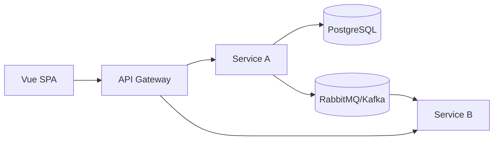

# Architecture: {{system_name}}

## Overview
{{narrative}}

## Frontend Architecture
- Framework: Vue 3 + Composition API + TypeScript
- State: Pinia (store map + cross-store communication rules)
- Routing: Vue Router (dynamic routes, RBAC guards)
- Styling: TailwindCSS (design token strategy)
- Build: Vite (code-splitting strategy)

## Backend Architecture
- Framework: FastAPI (router/service/repository/model layering)
- Persistence: PostgreSQL via SQLAlchemy + Alembic
- Caching: Redis (what's cached, invalidation strategy)
- Messaging: RabbitMQ / Kafka (event catalog reference)
- AuthN/AuthZ: JWT + OAuth flow summary

## Service Topology

## Deployment
- Docker: base images, multi-stage strategy
- Kubernetes: namespaces, deployments, HPA, probes
- AWS: services in use, network topology summary

## Cross-Cutting Concerns
- Observability
- Security
- Configuration management

## Module Boundaries
| Module | Owns | Depends On | Must Not Depend On |
|---|---|---|---|
