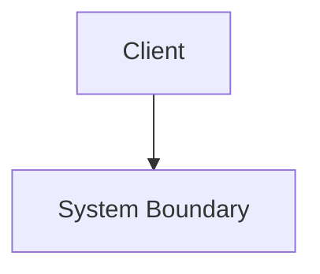

# High Level Design: {{system_or_feature_name}}

## 1. Overview
{{one paragraph: what this system/feature does and why}}

## 2. Goals & Non-Goals
- Goals:
- Non-Goals:

## 3. Context Diagram

## 4. Major Components
| Component | Responsibility | Owner Layer (Frontend/Backend/Infra) |
|---|---|---|

## 5. Data Flow (Narrative)
{{how data moves through the system end to end}}

## 6. External Dependencies
{{third-party services, other internal services, managed AWS services}}

## 7. Consistency & Availability Tradeoffs
{{CAP-theorem-informed reasoning for this specific system}}

## 8. Scalability Plan
{{horizontal/vertical scaling approach, statelessness, caching strategy}}

## 9. Security Model (Summary)
{{authN/authZ approach at a system level; link to detailed Authentication Flow diagram}}

## 10. Observability
{{logging, metrics, tracing strategy}}

## 11. Open Questions
{{unresolved design questions}}
