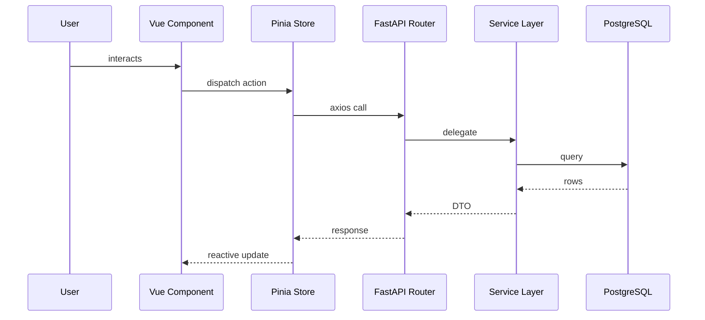

# Low Level Design: {{module_or_feature_name}}

## 1. Scope
{{which component from the HLD this LLD elaborates}}

## 2. Class / Module Design

### Frontend
```ts
// Pinia store shape
interface {{Feature}}State {
  // ...
}
```

### Backend
```python
# Pydantic schema / SQLAlchemy model sketch
class {{Feature}}Schema(BaseModel):
    ...
```

## 3. API Contract
| Method | Path | Request | Response | Auth |
|---|---|---|---|---|

## 4. Database Schema Changes
| Table | Column | Type | Constraint | Migration |
|---|---|---|---|---|

## 5. Sequence of Operations


## 6. Edge Cases
| Case | Expected Behavior |
|---|---|

## 7. Error Handling
{{typed exceptions, HTTP status mapping, frontend error surface}}

## 8. Performance Considerations
{{query plans, indexes, memoization, pagination}}

## 9. Test Plan Reference
{{link to Test Planner output}}
